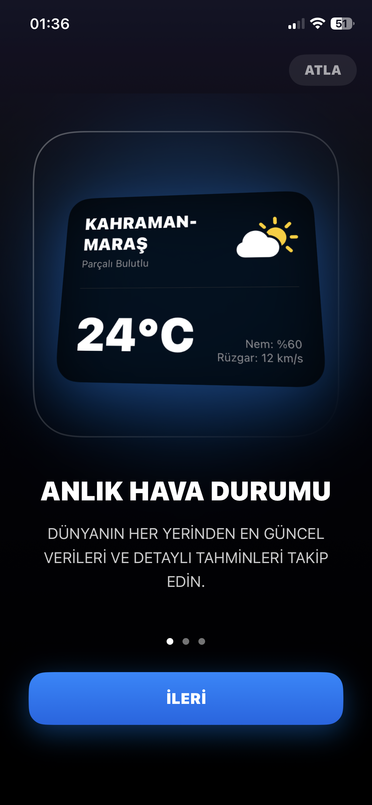
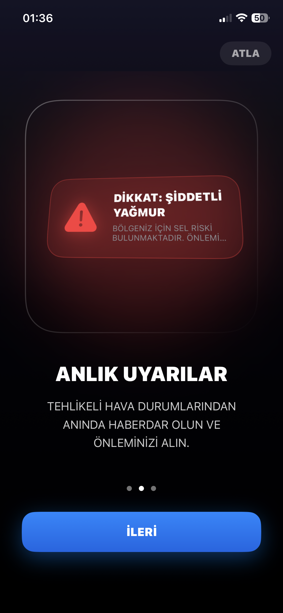
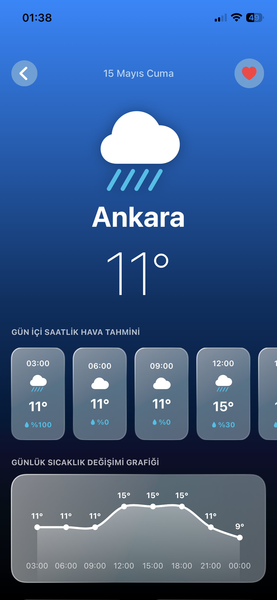

# 🌤️ Hava Durumu Asistanı

Modern SwiftUI teknolojileri ve MVVM mimarisi ile geliştirilmiş, anlık meteorolojik veri analizi ve takip platformu. Bu proje, bilgisayar programcılığı bitirme çalışması kapsamında geliştirilmiştir.

## 🚀 Öne Çıkan Özellikler

- **Anlık Veri Takibi:** OpenWeather API entegrasyonu ile dünya genelinde canlı hava durumu verileri.
- **Modern Arayüz:** Apple Human Interface Guidelines prensiplerine uygun, Glassmorphism temalı SwiftUI tasarımı.
- **Kullanıcı Yönetimi:** Firebase Authentication ile güvenli giriş ve favori şehir senkronizasyonu.
- **Hata ve Bildirim:** Kritik hava değişimlerinde kullanıcıyı uyaran yerel bildirim altyapısı ve optimize edilmiş hata yönetimi (UX).

---

## 🛠️ Teknik Altyapı

- **Dil:** Swift (Native)
- **Arayüz Framework:** SwiftUI
- **Mimari:** MVVM (Model-View-ViewModel)
- **Backend/DB:** Google Firebase
- **Veri Kaynağı:** OpenWeatherMap API

---

## 📱 Uygulama Önizlemesi

| Ana Ekran | Şehir Arama | Favori Şehirler |
| :---: | :---: | :---: |
|  |  |  |
| *Anlık Hava Durumu* | *Global Şehir Arama* | *Hızlı Erişim Listesi* |

| Giriş & Kayıt | Uygulama Ayarları | Hakkımızda |
| :---: | :---: | :---: |
|  |  |  |
| *Güvenli Bulut Bağlantısı* | *Kişiselleştirme* | *Kurumsal Künye* |

---

## 👨‍💻 Geliştirici

**Ahmet Çiçek** *Bilgisayar Programcılığı Bölümü - Bitirme Projesi* 📧 [acicek167@gmail.com](mailto:acicek167@gmail.com)

---

## 📄 Lisans & Yasal

Bu uygulama eğitim amaçlı geliştirilmiştir. Tüm hakları saklıdır. © 2026
